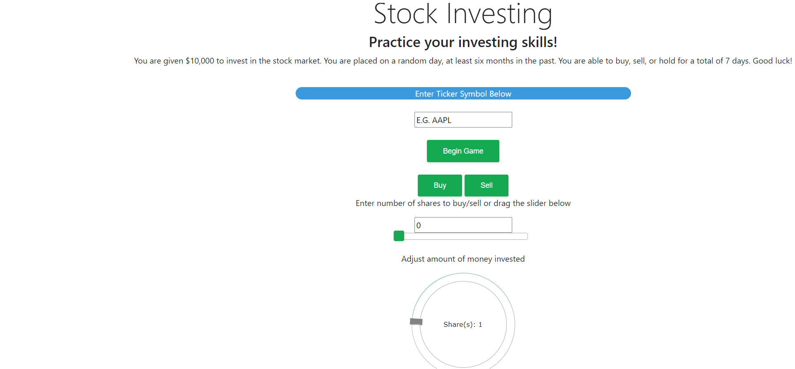
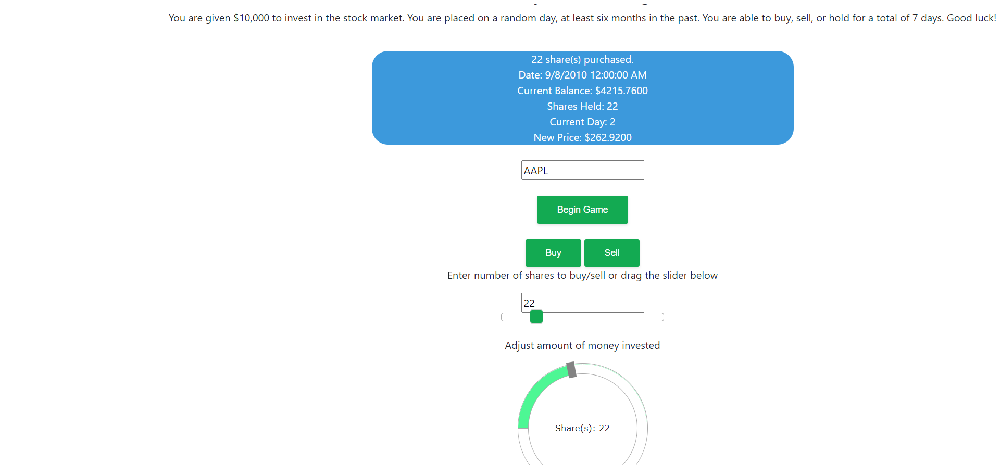
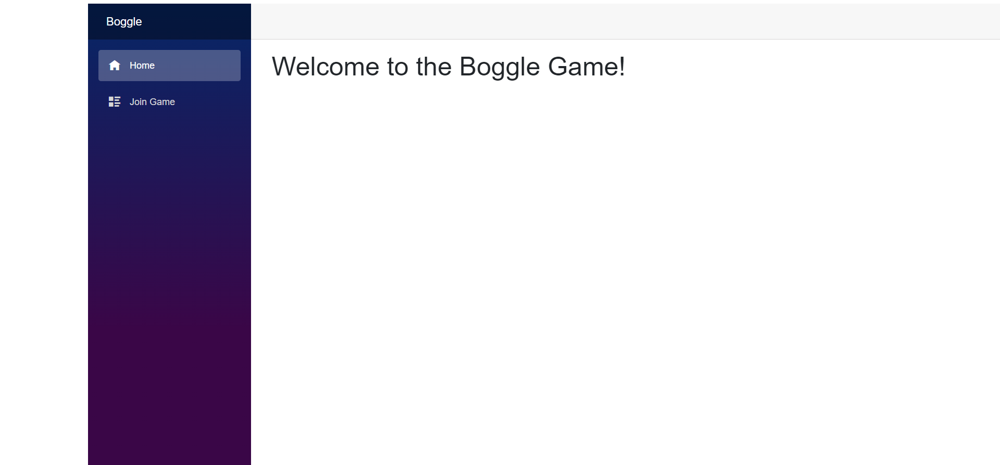
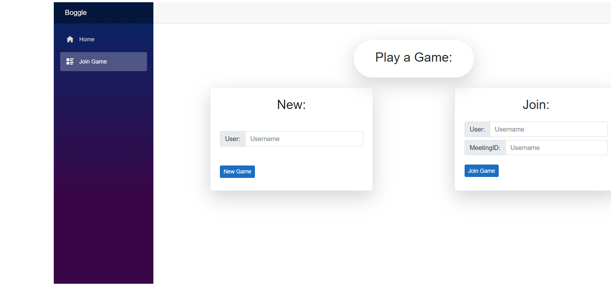
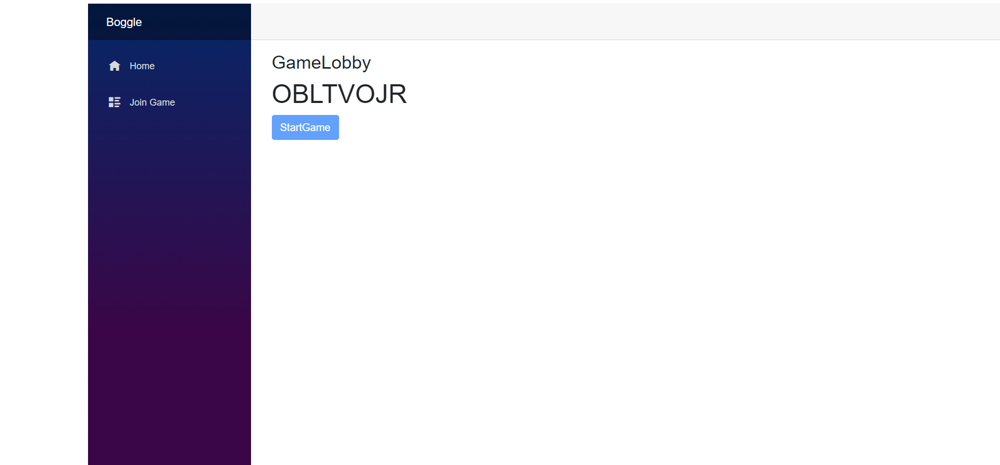
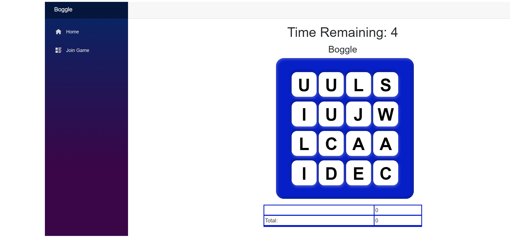
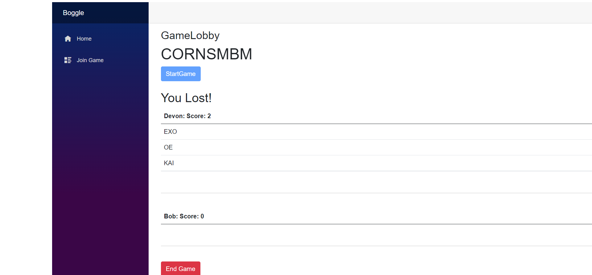

# Welcome to my Portfolio!
My name is Devon Jarman. I am a Senior in College and getting my Bachelor's in Computer Science. In my Software Engineering class I did four projects where I learned a lot and made some cool things. Here are my assignments.
## Hangman
This assignment was an online hangman game. This game was developed using php code. This was my first time using php. It was a challenge, but rewarding. Way better than javascript. This page has a login system that has password hashing and salting. This form of encryption helps to preserve user data. The login system also checks to verify user credentials. When creating an account the user is asked to enter username and password. The password has a confirmation that must mathch. I used infinty free as the server to the game. There is a database used to save user data, words to be guessed, and also highscores for each word length. The user can login into their account or create an account. After logging in, the user is taken to the game where they can play and guess letters until the word is guessed. They then go to a highscores tables, showing them the scores for that length of word. 


This block of code is the user credential authentication. It rehashes the password to check against the database to allow the user to login.

```
 $row = $result->fetch_assoc();
		$salt = $row["Salt"];
        $hash = $row["Hash"];
        //use sha256, hash the pass + salt
        $test = hash("sha256", $pass . $salt);
        if($test === $hash) {
            $sql = "SELECT Word, Length FROM Wordlist ORDER BY RAND() LIMIT 1;
```
            

### [Play Hangman](https://thejarman.epizy.com/Welcome.php)

### [Hangman Github](https://github.com/thejarman1/Hangman)
## Banking App
This project was an application for banking. A user if able to login and create an account. The passwords are salted and hashed to provide security. Once a user is logged in, they are allowed to deposit and withdraw money between accounts. The user is also able to to view account histories for each account. This program was builit in .net. This was my first time doing an application in it and was a challenging learning curve. The problem I had was passing the user data between pages. We figured out how to do session variables in C#, so then I was able to maintain the balance. This application has a backend database to track the transactions. We used Model, Control, and View design to build this program. In this program, I helped with the deposit and withdraw functions. I also helped with the transaction history page with pulling the transactions and displaying the data.


This code is used to make a withdraw and add the transaction to the history.
```
 public IActionResult Withdraw(AccountVM obj, int userId)
        {
            if (ModelState.IsValid)
            {
                int UserId = userId;

                //Accounts account = _unitOfWork.Account.GetFirstOrDefault(u => u.UserId == UserId && u.AccountTypeId == obj.Account.AccountTypeId, includeProperties: "User,AccountType");
                Accounts account = _db.Accounts.Where(u => u.UserId == UserId && u.AccountTypeId == obj.Account.AccountTypeId).FirstOrDefault();
                account.Balance = account.Balance - obj.Account.Balance;


                _unitOfWork.Account.Update(account);
                _unitOfWork.Save();

                Transactions newTransaction = new Transactions()
                {
                    AccountID = account.AccountId,
                    AccountTypeId = account.AccountTypeId,
                    UserId = account.UserId,
                    TransactionType = "Withdraw",
                    Balance = account.Balance,
                    Amount = obj.Account.Balance,
                    Date = DateTime.Now
                };

                _unitOfWork.Transaction.Add(newTransaction);
                _unitOfWork.Save();

                User user = _unitOfWork.Users.GetFirstOrDefault(u => u.userId == UserId);
                TempData["success"] = "Balance Updated.";
                return RedirectToAction("Bank", user);
            }

            obj.AccountTypeList = _unitOfWork.AccountType.GetAll().Select(i => new SelectListItem
            {
                Text = i.Name,
                Value = i.AccountTypeId.ToString()
            });

            return View(obj);
        }
```

### [Banking App Github](https://github.com/rflowers45/TigerBanking/tree/dale-almostcomplete)
## Stock Investing Game
This application pulls stock information from a random date for a given ticker. The user then gets to play a game that goes through a week where everyday they can buy/sell/hold stocks. At the end of the game the total gains/loses are displayed. There is a circle slider bound to the number of stocks text, so the user can enter how many stocks they want to buy, or they can drag the slider. For this project we used razor pages. On this assignment I found a way to use the ticker symbol to pull stock information and generate a random day. With the day the prices for that day were pulled for use and then updated with each day. This was a problem we were running into. I got a random day and got the prices for that day, but we were stuck with how to update the prices as the day progressed.




This code gets the random day and gets the stock prices for that day. 
```
int lastIndex = dailyPrices.Count() - 1; //This is used to get the total amount of indices in the list. For random generation
                var testDate = GetRandomDate(lastIndex); //Getting a random indices for closing stock price
                string dateString = dailyPrices[testDate].Timestamp.ToString();
                
                //This grabs the objects day
                var dayPrice = dailyPrices[testDate].Close;//This gets the price
                price = dayPrice; //Setting the global price to = the day price
                string displayResults = ("Getting data for " + value + "<br> Date: " + dateString + "<br> Closing price: $" + dayPrice);
		
	private int GetRandomDate(int indicesCount)
        {
            var random = new Random();
            var range = indicesCount - 60;
            var newDate = random.Next(range);

            return newDate;
        }

```

### [Stock Investing Game Github](https://github.com/rflowers45/StockInvestingGame)

## Boggle
This game was made using blazor. We had never used blazor before, so it was helpful and challenging to use. It worked really well for what we had to do. It did take some time to learn how to use it properly though. This game starts out on the home screen where a user joins a game. They either start or join a game. If they start a game, they are given a code that the other person uses to join the game. Once both users are in the lobby and click start the game begins. The users are given 30 seconds to find as many words as they can. They select letters and double click on the last letter to submit the word. Once the game ends, the winner is determined and the scores and words are displayed for each user. My part of this assignment was the front end development. I worked on the look and design of our assignment. I also implemented the functionality for the board.






### [Boggle Game Github](https://github.com/timw5/Boggle)
### [Play the Game!](https://sliceofbread.azurewebsites.net/)
