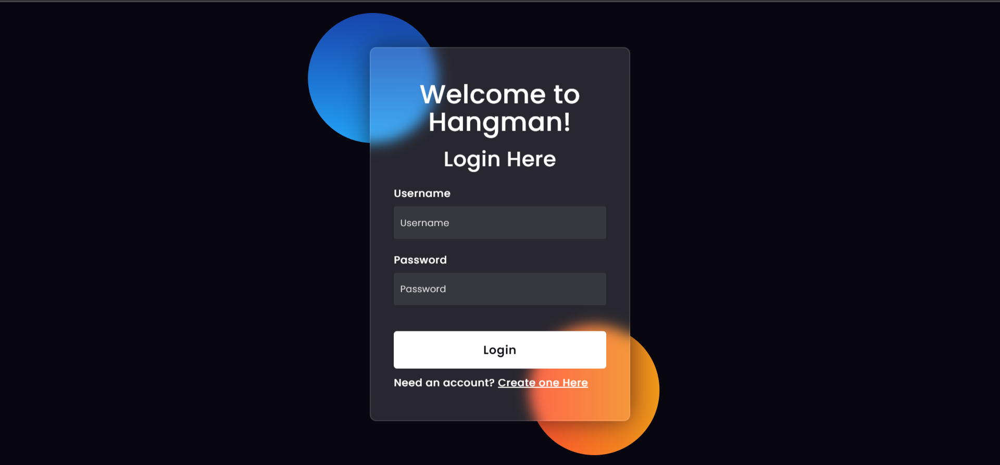
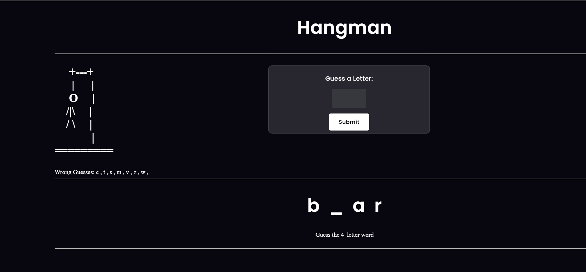
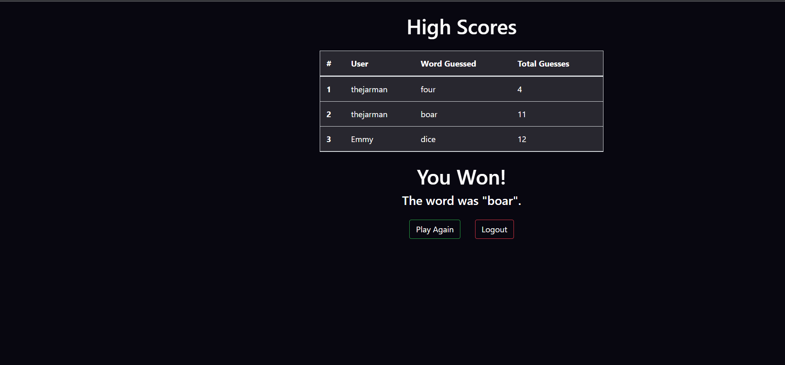
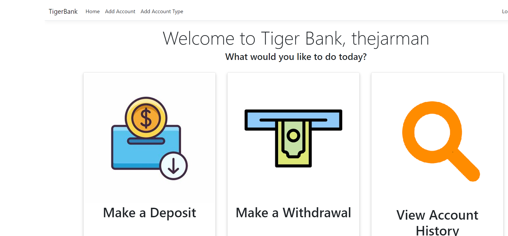
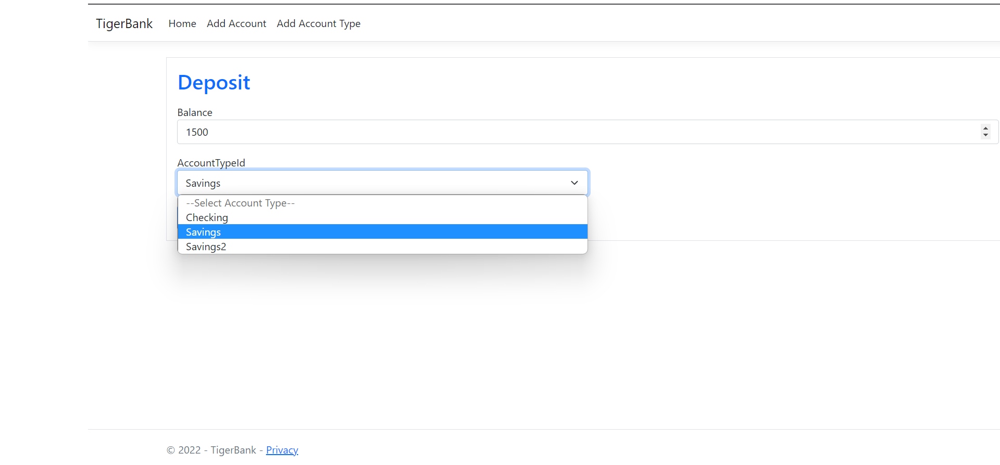
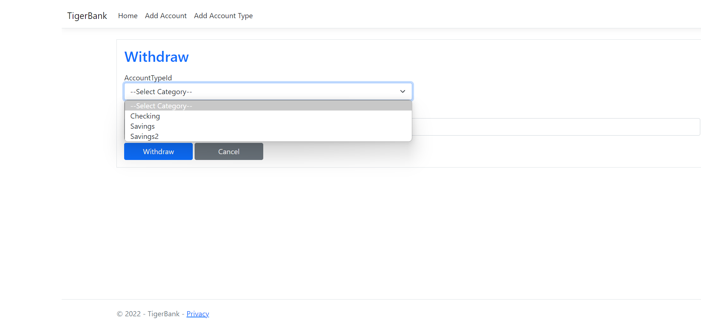
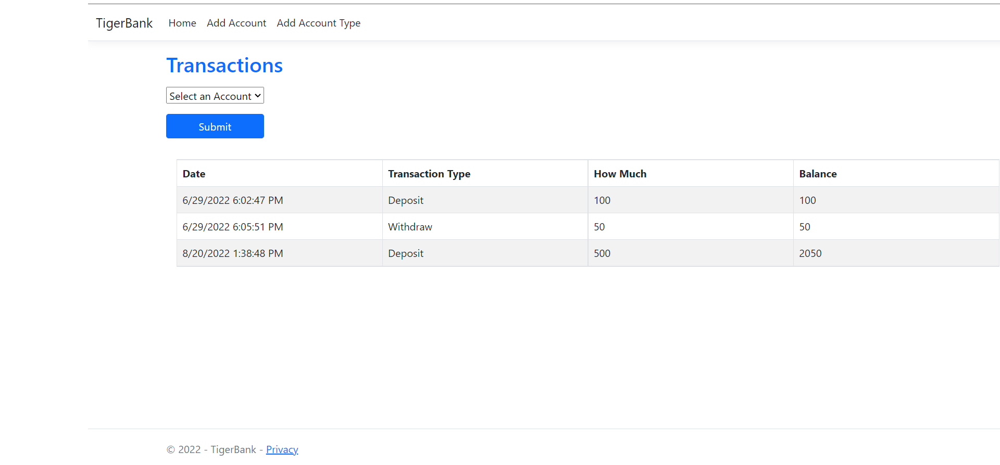

# Welcome to my Portfolio!
My name is Devon Jarman. I am a Senior in College and getting my Bachelor's in Computer Science. In my Software Engineering class I did four projects where I learned a lot and made some cool things. Here are my assignments.
## Hangman
This assignment was an online hangman game. This game was developed using php code. This was my first time using php. It was a challenge, but rewarding. Way better than javascript. This page has a login system that has password hashing and salting. This form of encryption helps to preserve user data. The login system also checks to verify user credentials. When creating an account the user is asked to enter username and password. The password has a confirmation that must mathch. I used infinty free as the server to the game. There is a database used to save user data, words to be guessed, and also highscores for each word length. The user can login into their account or create an account. After logging in, the user is taken to the game where they can play and guess letters until the word is guessed. They then go to a highscores tables, showing them the scores for that length of word. 




This block of code is the user credential authentication. It rehashes the password to check against the database to allow the user to login.

```
 $row = $result->fetch_assoc();
		$salt = $row["Salt"];
        $hash = $row["Hash"];
        //use sha256, hash the pass + salt
        $test = hash("sha256", $pass . $salt);
        if($test === $hash) {
            $sql = "SELECT Word, Length FROM Wordlist ORDER BY RAND() LIMIT 1;
```
            

### [Play Hangman](https://thejarman.epizy.com/Welcome.php)

### [Hangman Github](https://github.com/thejarman1/Hangman)
## Banking App
This project was an application for banking. A user if able to login and create an account. The passwords are salted and hashed to provide security. Once a user is logged in, they are allowed to deposit and withdraw money between accounts. The user is also able to to view account histories for each account. This program was builit in .net. This was my first time doing an application in it and was a challenging learning curve. The problem I had was passing the user data between pages. We figured out how to do session variables in C#, so then I was able to maintain the balance. This application has a backend database to track the transactions. 





This code is used to make a withdraw and add the transaction to the history.
```
 public IActionResult Withdraw(AccountVM obj, int userId)
        {
            if (ModelState.IsValid)
            {
                int UserId = userId;

                //Accounts account = _unitOfWork.Account.GetFirstOrDefault(u => u.UserId == UserId && u.AccountTypeId == obj.Account.AccountTypeId, includeProperties: "User,AccountType");
                Accounts account = _db.Accounts.Where(u => u.UserId == UserId && u.AccountTypeId == obj.Account.AccountTypeId).FirstOrDefault();
                account.Balance = account.Balance - obj.Account.Balance;


                _unitOfWork.Account.Update(account);
                _unitOfWork.Save();

                Transactions newTransaction = new Transactions()
                {
                    AccountID = account.AccountId,
                    AccountTypeId = account.AccountTypeId,
                    UserId = account.UserId,
                    TransactionType = "Withdraw",
                    Balance = account.Balance,
                    Amount = obj.Account.Balance,
                    Date = DateTime.Now
                };

                _unitOfWork.Transaction.Add(newTransaction);
                _unitOfWork.Save();

                User user = _unitOfWork.Users.GetFirstOrDefault(u => u.userId == UserId);
                TempData["success"] = "Balance Updated.";
                return RedirectToAction("Bank", user);
            }

            obj.AccountTypeList = _unitOfWork.AccountType.GetAll().Select(i => new SelectListItem
            {
                Text = i.Name,
                Value = i.AccountTypeId.ToString()
            });

            return View(obj);
        }
```

### [Banking App Github](https://github.com/rflowers45/TigerBanking/tree/dale-almostcomplete)
## Stock Investing Game

### [Stock Investing Game Github](https://github.com/rflowers45/StockInvestingGame)

## Boggle

### [Play the Boggle Game](https://github.com/timw5/Boggle)
